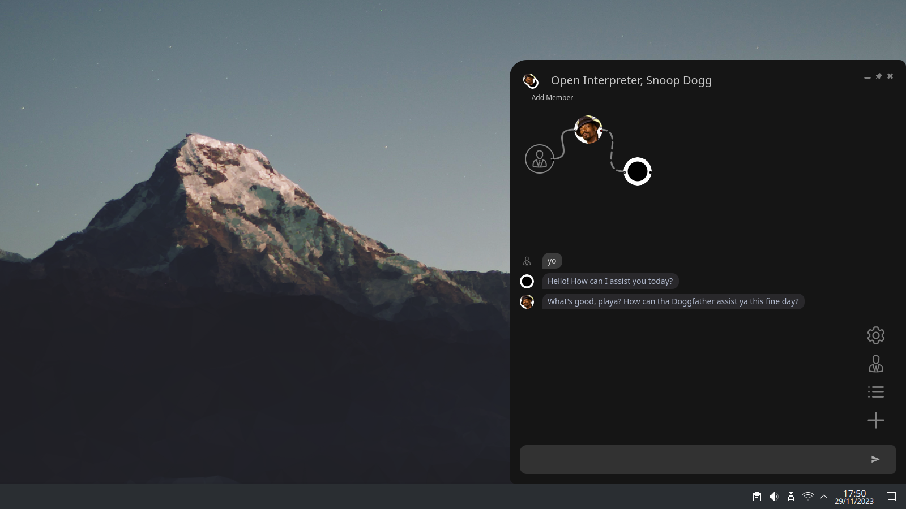
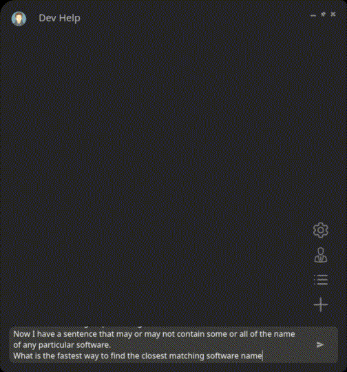
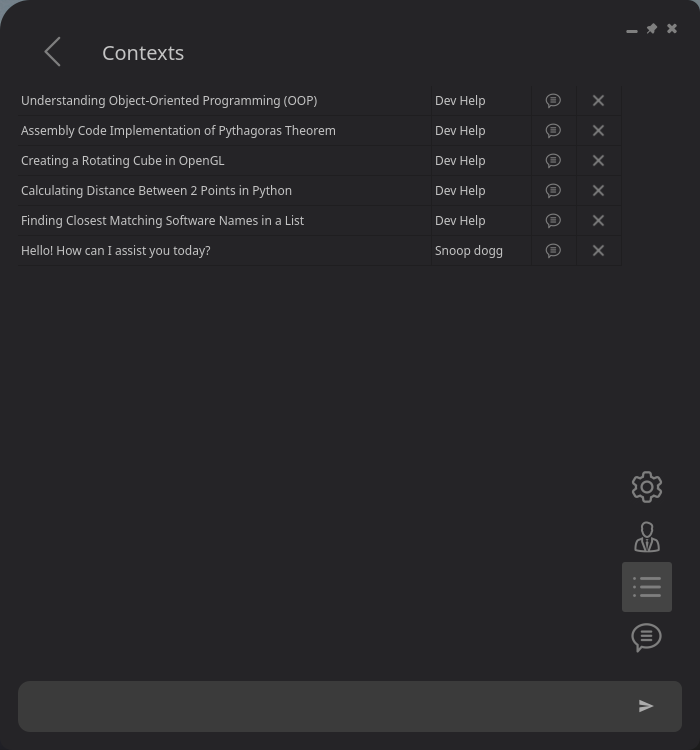

<h1 align="center">💬 Agent Pilot</h1>

️
  
  
A versatile workflow automation system. Create, organize, and execute complex AI-driven tasks.
Agent Pilot provides a seamless experience, whether you want to chat with a single LLM or a complex multi-member workflow.
  
With an intuitive and feature-rich interface, you can effortlessly design AI workflows and chat with them in real-time.
Branching chats are supported, allowing flexible interactions and iterative refinement.
  
Agent Pilot offers generative and customizable UI, allowing creation of custom pages and hierarchical configs.
This flexibility gives you the freedom to design an interface that aligns with your specific needs and effortlessly integrate into your workflows.
  
The system supports scheduled and recurring workflows that can be set to run based on natural language expressions of time, enabling automation that ranges from every second to every leap year.

  
  
  

  
  

## Quickstart

### Binaries
<table>
  <tr>
	<th>Platform</th>
	<th>Downloads</th>
  </tr>
  <tr>
	<td><b>Linux</b></td>
	<td>
<b><a href="https://sourceforge.net/projects/agentpilot/files/v0.5.0/AgentPilot_0.5.0_Linux_Portable.tar.gz/download" target="_blank">AgentPilot_0.5.0_Linux_Portable.tar.gz</a></b> 
<b>MD5:</b>  ad424809578b0eeb1bf732c80fd7a404 
<b>SHA1:</b> f38815aed742ea0baee2f4d76ccdf1c1c6c65db8 
	</td>
  </tr>
  <tr>
	<td><b>Windows</b></td>
	<td>
<b><a href="https://sourceforge.net/projects/agentpilot/files/v0.5.0/AgentPilot_0.5.0_Windows_Portable.zip/download" target="_blank">AgentPilot_0.5.0_Windows_Portable.zip</a></b> 
<b>MD5:</b> 0a29beb5a933e11eda46617c6c704699 
<b>SHA1:</b> a6a794210850fcf35da97982ea162a4cca41f39b 
	</td>
  </tr>
  <tr>
	<td><b>Mac Intel</b></td>
	<td>
<b><a href="https://sourceforge.net/projects/agentpilot/files/v0.5.0/AgentPilot_0.5.0_MacIntel_Portable.tar.gz/download" target="_blank">AgentPilot_0.5.0_MacIntel_Portable.tar.gz</a></b> 
<b>MD5:</b> ce8e9f15c338d2779d856dd81044ed27 
<b>SHA1:</b> 8a3c93ba08ed0357341737a98b0b297287f18d01 
	</td>
  </tr>
</table>

Building from source: [How to build from source](docs/guides/how_to_build.md)  

> [!TIP]
> You can migrate your old database to the new version by replacing your executable with the new one before starting the application.

## Features

###  👤 Create Agents
Create new agents, edit their configuration and organise them into folders. 
Multi-member workflows can be saved as a single agent and nested infinitely.

### 📝 Manage Chats
View, continue and delete previous workflow chats and organise them into folders. 

### 🌱 Branching Workflows
Messages, tools and code can be edited and re-run, allowing a more practical way to chat with your workflow. 
Branching works with all plugins and multi-member chats. 

### 👥 Graph Workflows
Seamlessly add other members or blocks to a workflow and configure how they interact with each other. 
Members aligned vertically are executed in parallel.

Available members:
- **User** - This is you and will await your input.
- **Agent** - Gets an LLM response with integrated tools and messages.
- **Text** - A simple text block that can nest other blocks.
- **Code** - Gets the output of any given code.
- **Prompt** - Gets an LLM response from a single prompt.
- **Module** - Runs or retrieves a method or variable from any module.
- **Workflow** - Any combination of the above types.

### 📦 Blocks
Manage a collection of nestable blocks available to use in any workflow or text field, 
allowing reusability and consistency. 
By default a block is a simple text block, but it can be any of the above member types, even a multi-member workflow. 
These can be quickly dropped into any workflow, or used in text fields (such as system message) by using the block name in curly braces, e.g. `{block-name}`.

### 🔨 Tools
Create and manage tools which can be assigned to agents. 
Tools share the same functionality as blocks, except by default they are a single Code member.  
They can also be an entire workflow, this allows your agents to not only run code but an entire workflow if you wish. 
Configure their parameters, which can be accesed from all workflow member types.
These parameters can be modified at runtime and re-executed, this creates a branch point which you can cycle through.

### 💻 Modules
Modules are python files which are imported at runtime. 
These are useful for things like toolkits, daemons, memory, custom pages or anything that needs persistence.

### 📐 Customizable UI
Includes a flexible and powerful set of base classes for building complex hierarchical configuration interfaces. 
The entire app is built on this framework.
Developers can modify or create configuration pages easily, even while the app is running.

### 🕒 Scheduler (Premium)
Schedule workflows to run at specific times or intervals. 
Natural language expressions are supported, allowing for flexible scheduling. 
For example, you can schedule a workflow to run every 5 minutes, every day at 3pm, or every 2nd Tuesday of the month.

### 📄 Structured Outputs
Members can be configured to output structured data, thanks to [Instructor](https://github.com/instructor-ai/instructor). 

### 📦 Addons
Create and import custom addons to extend the functionality of Agent Pilot. 

### 💻 Code Interpreter
Open Interpreter is integrated into Agent Pilot, and can either be used standalone as a plugin 
or used to execute code in 9 languages (Python, Shell, AppleScript, HTML, JavaScript, PowerShell, R, React, Ruby)

Code can be executed in multiple ways:
- From any 'Code' member in any workflow (Chat, Block, Tool).
- From a message with the role 'Code'

You should always understand the code that is being run, any code you execute is your own responsibility.

For code messages, auto-run can be enabled in the settings.
To see code messages in action talk to the pre-configured Open Interpreter agent.

### 🪄 AI Generation
Blocks under the 'System Blocks' folder are used for generating or enhancing fields.
Claude's prompt generator is included by default, you can tweak it or create your own.
- **Prompt** - AI enhanced user input
- **Agent** - AI generated agent (Coming soon)
- - **System message** - AI generated system message (Coming soon)
- **Page** - AI generated page (Coming soon)

### 🔌 Plugins
Agent Pilot supports the following plugins:
- **Agent** - Create custom agent behaviour.
- - [Open Interpreter](https://github.com/KillianLucas/open-interpreter)
- - [OpenAI Assistant](/)
- - [CrewAI Agent](/) (Currently disabled)
- **Workflow** - Create workflow behaviour.
- - [CrewAI Workflow](/) (Currently disabled)
- **Provider** - Add support for a model provider.
- - [Litellm (100+ models)](/)

- [Create a plugin](/)

### 👄 Voice
**Coming back soon** 
~~Agents can be linked to a text-to-speech service, combine with a personality context block and make your agent come to life!~~ 

### 🔠 Models
LiteLLM is integrated and supports the following providers: 

- AI21
- AWS Bedrock
- AWS Sagemaker
- Aleph Alpha
- Anthropic
- Anyscale
- Azure OpenAI
- Baseten
- Cloudflare
- Cohere
- Custom API Servers
- DeepInfra
- DeepSeek
- Gemini
- Github
- Groq
- Huggingface
- Mistral
- NLP Cloud
- Nvidia NIM
- Ollama
- OpenAI
- OpenRouter
- PaLM API Google
- Perplexity AI
- Petals
- Replicate
- Together AI
- VLLM
- VertexAI Google
- Voyage

## Contributions
Contributions to Agent Pilot are welcome and appreciated. Please feel free to submit a pull request.

## Known Issues
- Be careful using auto run code and open interpreter, any chat you open, if code is the last message it will start auto running, I'll add a flag to remember if the countdown has been stopped.
- Windows exe must have console visible due to a strange bug.
- Issue on linux, creating venv does not install pip 
- Changing the config of an OpenAI Assistant won't reload the assistant, for now close and reopen the chat.

If you find this project useful please consider showing support by giving a star or leaving a tip :)
  
BTC:  
ETH:  
