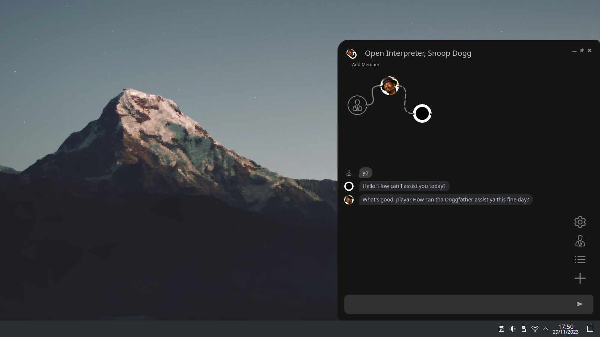

<h1 align="center">Agent Pilot</h1>

  <b>
   · The Everything Interface 
   · Modular plugin system 
   · Graph workflow builder 
   · Project studio 
   · Live vibecoding</b>
   </b>

  

  
  
  

Agent Pilot is a generative, fully customizable desktop application. With a flexible plugin system and schema-driven UI. Includes multiple prebuilt plugins ready to use.

Create projects with a coding agent (Claude Code), keep chats organized per project.
Inject into your coding agent's context any workflow from your block library for dynamic or grounded context.

The application is itself a project, and can be modified by coding agents live while it's running, enabling real-time vibecoding where you can see changes reflected instantly without restarting. This is not enabled by default.

Includes a powerful AI workflow engine. Design modular, nestable workflows with a graph-based editor and execute them. Granular, branching execution is possible, allowing flexible interactions and iterative refinement. 

Many member types are available, from templatable Text, system actions such as Wait or Notification, configured agents, or any AI model available from Litellm, Replicate, Wavespeed or Fal AI. API keys are required, local models are not supported yet.

Workflow executions are saved in the 'Chats' page, these can be anything, a chat with a single LLM, a Claude Code session in a project, a templated text workflow for automated documentation. Anything is possible with a workflow.

Manage a collection of workflows in the Block library, allowing reusability and consistency .
These can be used from specific places within the app, can quickly be dropped into any workflow, or can be used in templated text (such as system message) by using the block name in double curly braces: "{{ block_name }}"

## Quickstart

### Download

Binaries for 0.6.0 are not available yet, see instructions to [build from source](docs/guides/how_to_build.md)

Live vibe coding is currently only available if running from source.

> **Tip:** You can migrate your database to the new version by replacing the executable before launching.

## Documentation
[User guide](docs/guides/how_to_use.md) 
[Module documentation](docs/guides/modules.md) 
[Core Architecture](docs/guides/how_to_build.md) 
[GUI Architecture](docs/guides/how_to_build.md) 
[Creating a plugin](docs/guides/how_to_build.md) 

## Plugins
An AgentPilot plugin is a collection of modules bundled together and placed in the `src/plugins` directory.
 By organizing related modules into a single plugin, all modules related to a feature or integration are kept together, making development and maintenance easier.
 The application automatically discovers and loads plugins from the `src/plugins` directory at startup. Each module inside a plugin is registered and made available in the app.

### Included plugins
- **[Workflows](src/plugins/workflows)** &mdash; Core AI workflow engine
- **[Tasks](src/plugins/tasks)** &mdash; Scheduled & recurring workflows
- **[Projects](src/plugins/projects)** &mdash; Project modification using AI Agents
- **[Studio](src/plugins/studio)** &mdash; Creative studio with Gen AI capabilities
- **[Files](src/plugins/files)** &mdash; File explorer with an optional AI agent
- **[Slopify](src/plugins/slopify)** &mdash; AI Music streaming & generation
- **[Finance](src/plugins/finance)** &mdash; Financial data, portfolio analysis & automation

## Integrations

### Database Connectors
- **[SQLite](src/core/connectors/sqlite.py)**
- **[MySQL](src/core/connectors/mysql.py)**
- **[PostgreSQL](src/core/connectors/postgres.py)**

### Model Providers
- **[LiteLLM](src/plugins/workflows/providers/litellm.py)**
- **[FalAI](src/plugins/workflows/providers/fal.py)**
- **[Replicate](src/plugins/workflows/providers/replicate.py)**
- **[Wavespeed](src/plugins/workflows/providers/wavespeed.py)**

### External Agents
- **[Claude Code](src/plugins/claude_code)**
- ~~**[Codex CLI](src/plugins/codex_cli)**~~
- ~~**[Gemini CLI](src/plugins/gemini_cli)**~~

## Contributing

Contributions are welcome. Please feel free to submit a pull request.

## Known issues:

Models with unsupported, arbitrary or niche outputs may not be available or not work even if they are. Support for specific models can be requested and I'll see what I can do.

There is no in-app way of seeing the cost of specific models.

Local models aren't supported (except through a LiteLLM proxy)

## License

[AGPL-3.0](LICENSE)